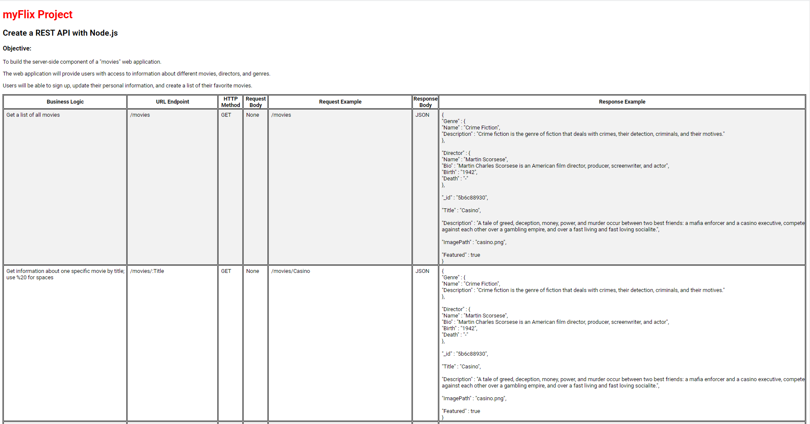
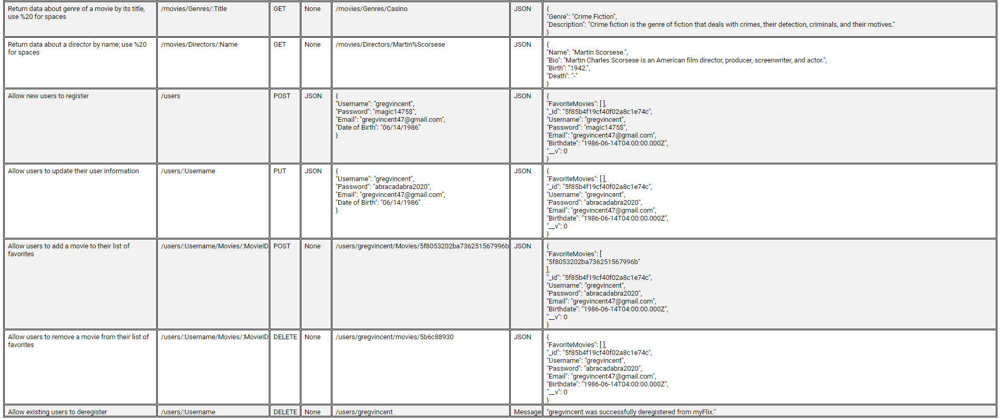

# MyFlix API

Server-side API built for MyFlix web application. 
MyFlix provides users with detailed movie data (stored in MongoDB), including movie description, director data (name, bio, dates of birth/death), and genre data (name and description).

## API Documentation 
(located at https://myflix2020.herokuapp.com/documentation.html)
  

## Features and Technical Information

- Server built with Node.js and Express.
- API ncorporates REST architecture; URI endpoints correspond to respective data operations.
- Movie and User Collections stored in MongoDB.
- Postman utilized to test endpoints.
- API implements user authentication/authorization and data validation logic.
- Deployed using Heroku

## Client-side applications utilizing API

- MyFlix (React) https://myflix2020.netlify.app
- MyFlix (Angular) https://glenvasa.github.io/cinema-2021
